# Full-Featured-Blog-Application
---
<div align="center">
  
</div>
<br>
> Maintained by <a rel="" href="https://github.com/cosmicray001">MD SAMIUL ISLAM</a>

---
## Contents

- [Overview](#overview)
- [Technology Used](#technology-used)
  - [Frontend](#frontend)
  - [Backend](#backend)
  - [Version Control](#version-control)
  - [Database](#Database)
  - [Cloud Platforms](#cloud-platforms)
- [Functionality](#functionality)
  - [Create Account](#create-account)
  - [Create Post](#create-post)
  - [Edit Post](#edit-post)
  - [Delete Post](#delete-post)
  - [Share Post](#share-post)
  - [Published Post List](#published-post-list)
  - [Draft Post List](#draft-post-list)
  - [Search Post](#search-post)
  - [Latest Post](#Latest-post)
  - [Most commented Post](#most-commented-post)
  - [RSS Feed](#rss-feed)
<!-- - [Project Setup](#project-setup) -->
---
## Overview
```djBlogApp``` is a full featured blog web app, that can do CRUD operation. Users have the ability to create account, create posts, update posts, delete posts. Moreover, Any registered user can comment on any post and can share the posts via email as well. There is a searching option for filtering posts.

---

## Technology Used
### Frontend
- HTML5
- CSS3
- Bootstrap4
### Backend
- Python
- Django
### Version Control
- Git
### Database
- PostgreSQL
### Cloud Platforms
- Heroku

---

## Functionality
### Create Account
User can create an account by submitting some basic information.
<div align="center">
  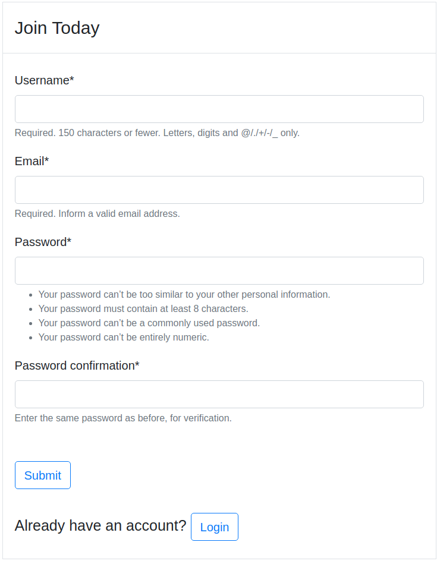
</div>

### Create Post
Any registered User have the ability to create post by submitting title, and body. User can add tags and save the post as published or draft.
<div align="center">
  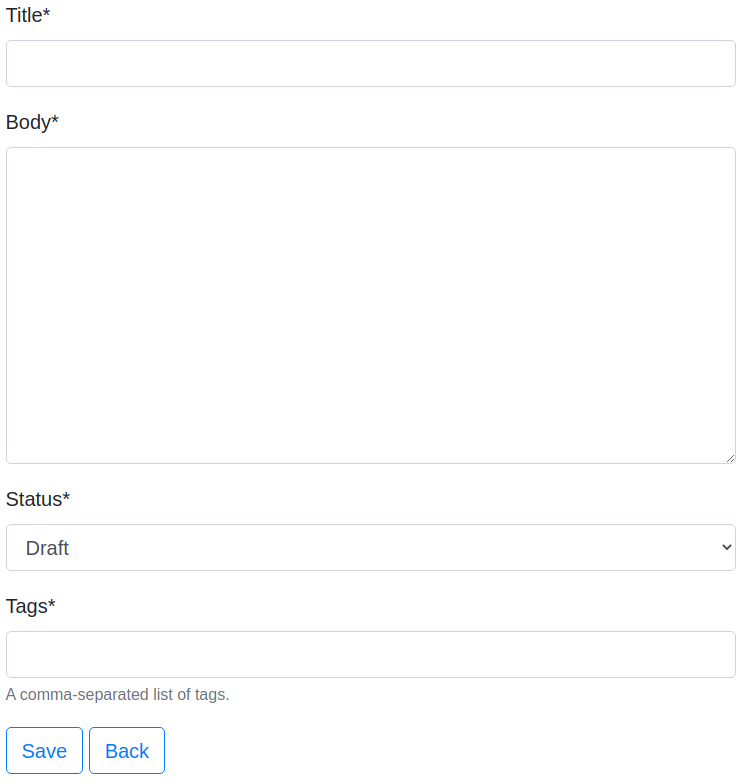
</div>

After creating the post user will be redirected to the post details page.
<div align="center">
  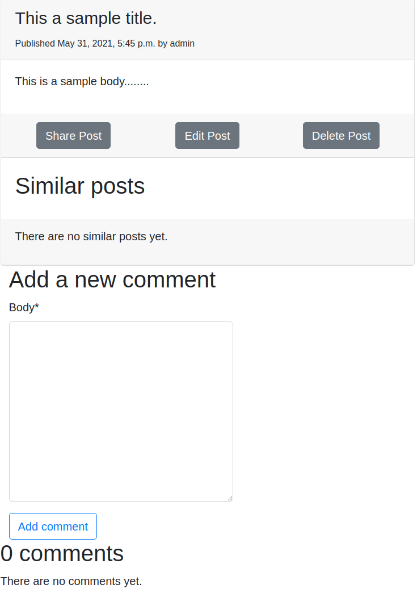
</div>

### Edit Post
A post owner can also update the post.
<div align="center">
  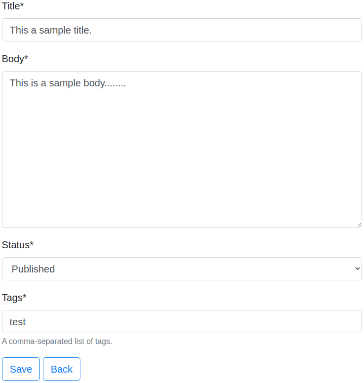
</div>

### Delete Post
If the post creator want to remove the post there is a option to delete the post.
<div align="center">
  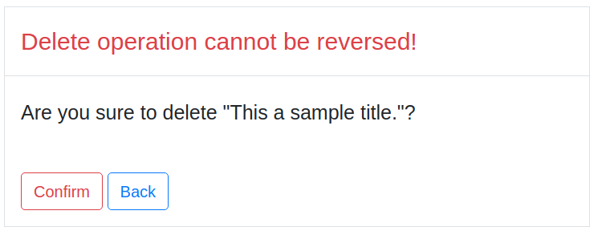
</div>

### Share Post
Anyone can share a post via email address.
<div align="center">
  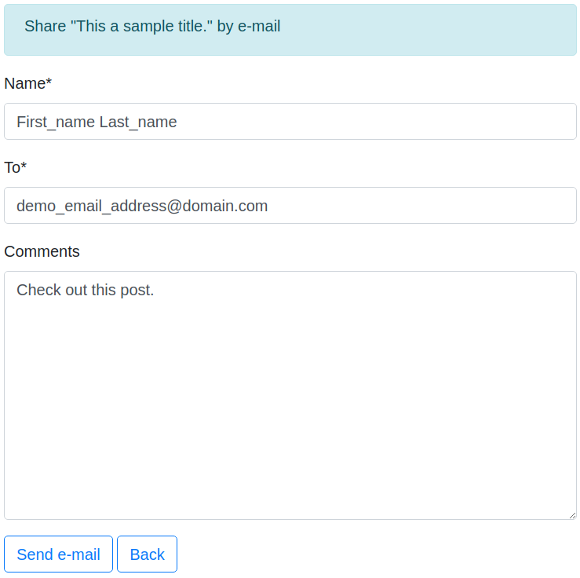
</div>

### Published Post List
If user create post as published then that post will be shown in this page.
<div align="center">
  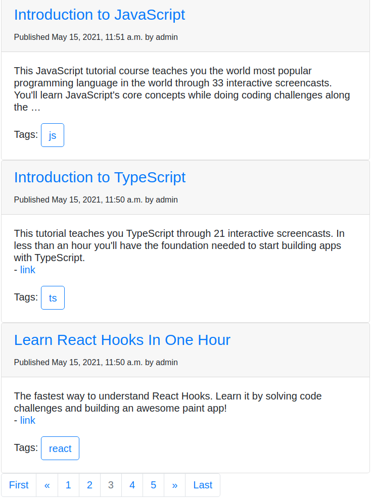
</div>

### Draft Post List
On the other hand, draft posts will be shown here.
<div align="center">
  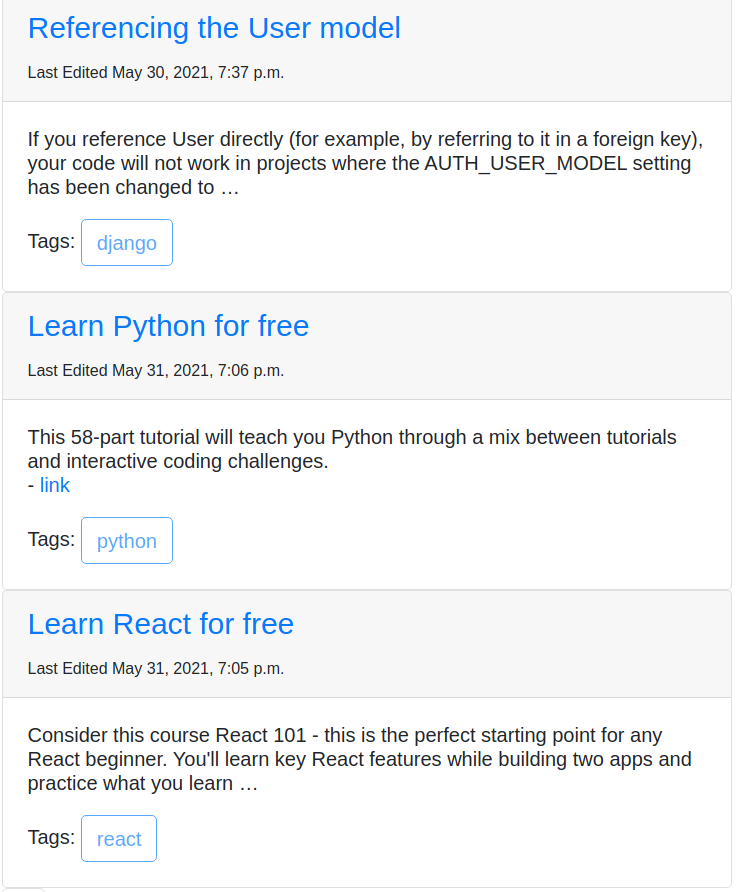
</div>

### Search Post
Anyone can search post by title of the post.
<div align="center">
  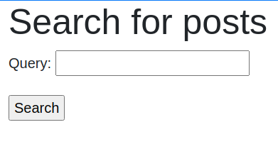
</div>
<br>
<div align="center">
  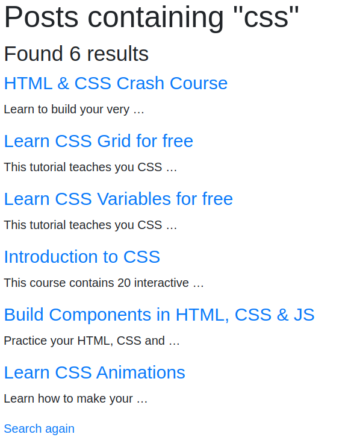
</div>

### Latest Post
After creating a post as Published will be added here. And last 5 posts will be shown here.
<div align="center">
  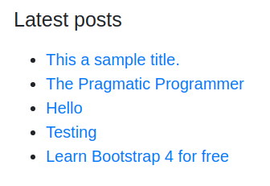
</div>

### Most commented Post
Last five most commented posts will be shown here.
<div align="center">
  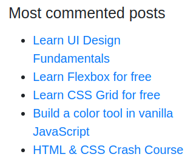
</div>

### RSS Feed
Finally there is a RSS Feed of this website.
<div align="center">
  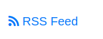
</div>

---

